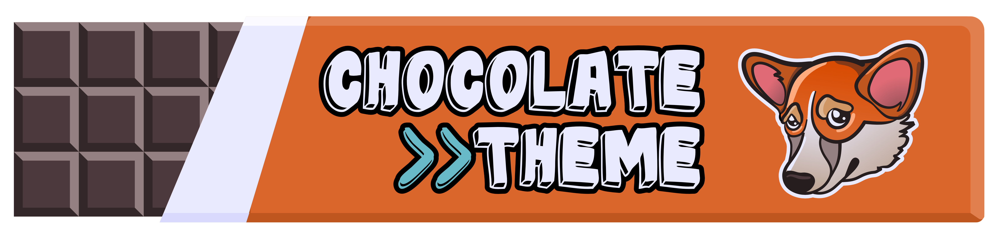

# Chocolate theme [](https://melpa.org/#/chocolate-theme)


> Poor doggies can't experience it because of two reasons

---

Chocolate theme is my personal attempt to develop a complex fully-functional theme for Emacs. It's dark, it's chocolaty, it's vibrant and it's subtle, it's whatever you're looking for in a perfect theme for development. 

## Installation

### Install from MELPA

It's available on [Melpa](https://melpa.org/):

<kbd>M-x package-install [RET] chocolate-theme [RET]</kbd>

<kbd>M-x load-theme [RET] chocolate [RET]</kbd>

Or using [use-package](https://github.com/jwiegley/use-package):

``` emacs-lisp
(use-package chocolate-theme
  :ensure t
  :config
  (load-theme 'chocolate t))
```

### Install manually

Download [chocolate-theme.el](./chocolate-theme.el) and copy it into the  `~/.emacs.d/themes` directory.

Then add the following code to your `init.el` configuration:

``` emacs-lisp
(add-to-list 'custom-theme-load-path "~/.emacs.d/themes")
(load-theme 'chocolate t)
```

## Screenshots

### Emacs Lisp


### C++


### Python


### Ediff


## Contribute

All contributions are most welcome!

I obviously don't use all of the modes out there and `chocolate-theme` can have a few blind spots. If you notice one, feel free reporting it. Please, add a meaningful example and a screenshot. If you can fix it on your own, I'll try to look at your pull request ASAP! But examples and screenshots will still make it faster.

## Credits

`chocolate-theme` is based on a great palette from the [firewatch-hot-syntax](https://github.com/rricard/firewatch-hot-syntax "firewatch-hot-syntax") theme for Atom (which in its turn was inspired by [firewatch-syntax](https://github.com/SebastianSzturo/firewatch-syntax "firewatch-syntax")).

## License

[GPL-3.0](./LICENSE)
