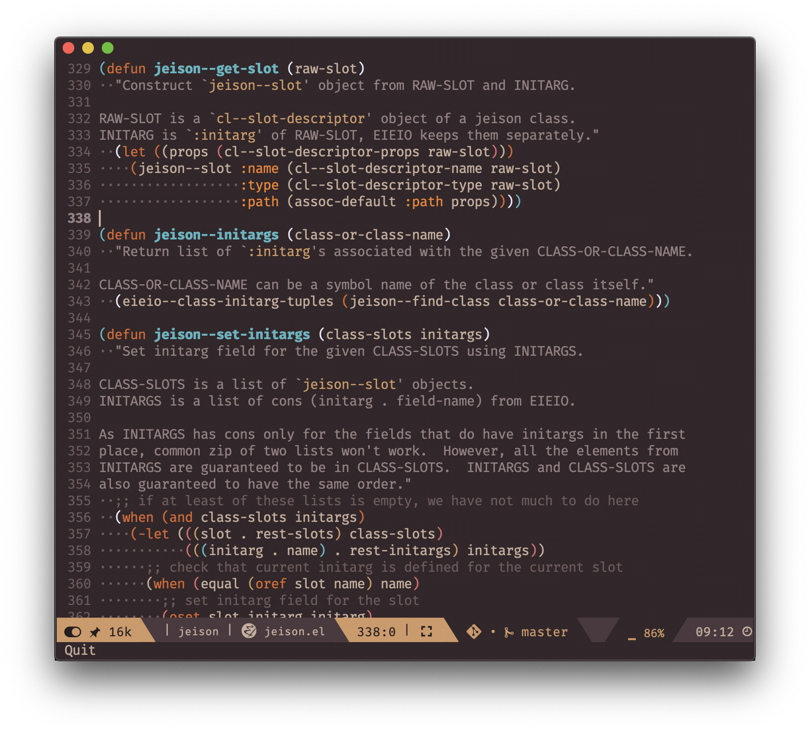
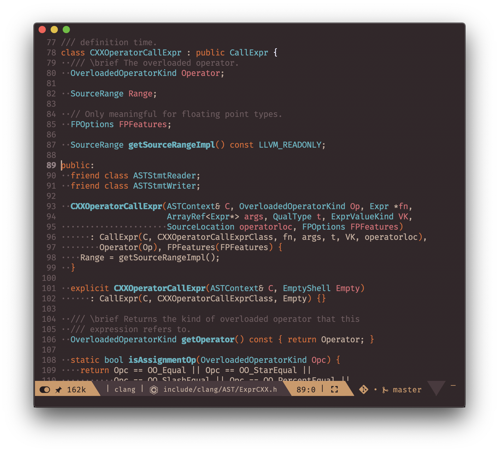
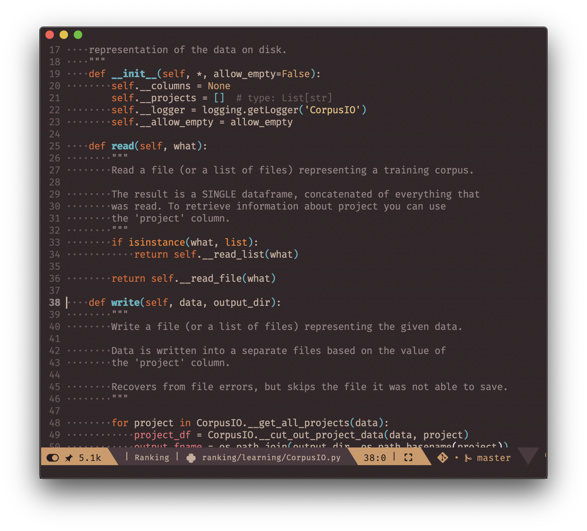
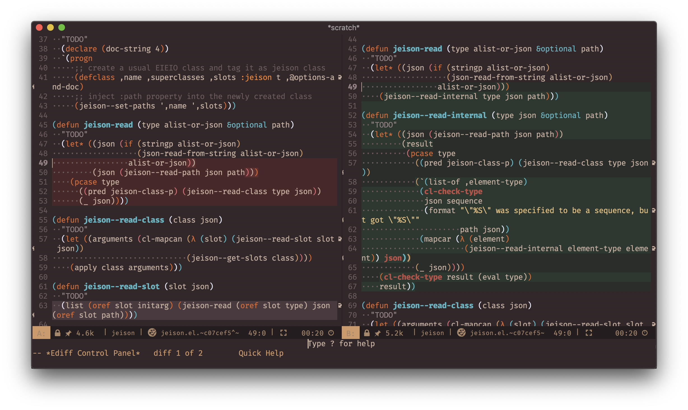

# Chocolate theme

Chocolate theme is my personal attempt to develop a complex fully-functional theme for Emacs. It is inspired by a great palette from [firewatch-hot-syntax](https://github.com/rricard/firewatch-hot-syntax "firewatch-hot-syntax") theme for Atom (which in its turn was inspired by [firewatch-syntax](https://github.com/SebastianSzturo/firewatch-syntax "firewatch-syntax") theme).

## Screenshots

### Emacs Lisp

### C++

### Python

### Ediff

